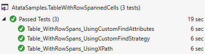

# [Atata Samples](https://github.com/atata-framework/atata-samples) / Table with Row-Spanned Cells

[](https://github.com/atata-framework/atata-samples/raw/main/_archives/TableWithRowSpannedCells.zip)

Demonstrates 3 different Atata approaches to work with table that has cells with `rowspan`.

*[Download sources](https://github.com/atata-framework/atata-samples/raw/main/_archives/TableWithRowSpannedCells.zip), run tests, check results and experiment with [Atata Framework](https://atata.io).*

## Page Under Test

<https://demo.atata.io/table-with-row-spanned-cells>


## Approach #1: Using FindByXPathAttribute

Uses power of XPath to find cell indices.
But able to find only by indices, check Approach #3 to find cells by column header text.

### Page Object

*TableUsingXPathPage.cs*

```cs
using Atata;

namespace AtataSamples.TableWithRowSpannedCells;

using _ = TableUsingXPathPage;

[Url("table-with-row-spanned-cells")]
public sealed class TableUsingXPathPage : Page<_>
{
    public Table<UserRow, _> Users { get; private set; }

    public sealed class UserRow : TableRow<_>
    {
        [FindByXPath(XPathTo.RowSpannedCell, Index = 0)]
        public Text<_> Name { get; private set; }

        [FindByXPath(XPathTo.RowSpannedCell, Index = 2)]
        [Format("yyyy-MM-dd")]
        public Date<_> StartDate { get; private set; }

        [FindByXPath(XPathTo.RowSpannedCell, Index = 8)]
        public Text<_> ExpertiseLevel { get; private set; }

        [FindByXPath(XPathTo.NonRowSpannedCell, Index = 0)]
        public Text<_> Client { get; private set; }

        [FindByXPath(XPathTo.NonRowSpannedCell, Index = 1)]
        public Text<_> Project { get; private set; }

        [FindByXPath(XPathTo.NonRowSpannedCell, Index = 16)]
        public Number<_> DirectProjectCost { get; private set; }

        [FindByXPath(XPathTo.RowSpannedCell, Index = 22)]
        public Number<_> GrossMarginPercent { get; private set; }

        private static class XPathTo
        {
            public const string RowSpannedCell = "(self::*[td[@rowspan]] | preceding-sibling::tr[td[@rowspan]])[last()]/td[@rowspan]";

            public const string NonRowSpannedCell = "td[not(@rowspan)]";
        }
    }
}
```

## Approach #2: Using Custom Find Attributes

This approach is improvement of Approach #1.
It extracts XPath's to custom find attributes.
Extraction gives better usability of XPath search.

### Attributes

*FindByRowSpannedCellIndexAttribute.cs*
```cs
using Atata;

namespace AtataSamples.TableWithRowSpannedCells;

public sealed class FindByRowSpannedCellIndexAttribute : FindByXPathAttribute
{
    public FindByRowSpannedCellIndexAttribute(int index)
        : base($"(self::*[td[@rowspan]] | preceding-sibling::tr[td[@rowspan]])[last()]/td[@rowspan]") =>
        Index = index;
}
```

*FindByNonRowSpannedCellIndexAttribute.cs*
```cs
using Atata;

namespace AtataSamples.TableWithRowSpannedCells;

public sealed class FindByNonRowSpannedCellIndexAttribute : FindByXPathAttribute
{
    public FindByNonRowSpannedCellIndexAttribute(int index)
        : base($"td[not(@rowspan)]") =>
        Index = index;
}
```

### Page Object

*TableUsingCustomFindAttributesPage.cs*

```cs
using Atata;

namespace AtataSamples.TableWithRowSpannedCells;

using _ = TableUsingCustomFindAttributesPage;

[Url("table-with-row-spanned-cells")]
public sealed class TableUsingCustomFindAttributesPage : Page<_>
{
    public Table<UserRow, _> Users { get; private set; }

    public sealed class UserRow : TableRow<_>
    {
        [FindByRowSpannedCellIndex(0)]
        public Text<_> Name { get; private set; }

        [FindByRowSpannedCellIndex(2)]
        [Format("yyyy-MM-dd")]
        public Date<_> StartDate { get; private set; }

        [FindByRowSpannedCellIndex(8)]
        public Text<_> ExpertiseLevel { get; private set; }

        [FindByNonRowSpannedCellIndex(0)]
        public Text<_> Client { get; private set; }

        [FindByNonRowSpannedCellIndex(1)]
        public Text<_> Project { get; private set; }

        [FindByNonRowSpannedCellIndex(16)]
        public Number<_> DirectProjectCost { get; private set; }

        [FindByRowSpannedCellIndex(22)]
        public Number<_> GrossMarginPercent { get; private set; }
    }
}
```

## Approach #3: Using Custom Find Strategy

Gives ability to find cells by column header text contents.
By using custom strategy it is possible to configure finding of elements in any custom way.

### Strategy

*FindByColumnHeaderInTableWithRowSpannedCellsStrategy.cs*

```cs
using System;
using System.Collections.Concurrent;
using System.Collections.Generic;
using System.Collections.ObjectModel;
using System.Linq;
using Atata;
using OpenQA.Selenium;

namespace AtataSamples.TableWithRowSpannedCells;

public sealed class FindByColumnHeaderInTableWithRowSpannedCellsStrategy : IComponentScopeFindStrategy
{
    protected static ConcurrentDictionary<Type, List<ColumnInfo>> TableColumnsInfoCache { get; } = [];

    public string RowXPath { get; set; } = "tr";

    public string HeaderCellsXPath { get; set; } = "(ancestor::table)[position() = last()]/thead//th";

    public string RowWithSpannedCellsXPathCondition { get; set; } = "td[@rowspan and normalize-space(@rowspan) != '1']";

    public ComponentScopeFindResult Find(ISearchContext scope, ComponentScopeFindOptions options, SearchOptions searchOptions)
    {
        string xPath = BuildXPath(scope, options);

        if (xPath is null)
        {
            if (searchOptions.IsSafely)
                return ComponentScopeFindResult.Missing;
            else
                throw ElementExceptionFactory.CreateForNotFound(options.GetTermsAsString(), searchContext: scope);
        }

        var xPathOptions = options.Clone();
        xPathOptions.Index = 0;
        xPathOptions.Terms = new[] { xPath };

        return new SubsequentComponentScopeFindResult(scope, new FindByXPathStrategy(), xPathOptions);
    }

    protected virtual string BuildXPath(ISearchContext scope, ComponentScopeFindOptions options)
    {
        List<ColumnInfo> columns = TableColumnsInfoCache.GetOrAdd(
            options.Metadata.ParentComponentType,
            _ => GetColumnInfoItems((IWebElement)scope));

        ColumnInfo column = columns
            .Where(x => options.Match.IsMatch(x.HeaderName, options.Terms))
            .ElementAtOrDefault(options.Index ?? 0);

        return column is not null ? BuildXPathForCell(column, columns) : null;
    }

    protected virtual string BuildXPathForCell(ColumnInfo column, List<ColumnInfo> columns)
    {
        string rowSpannedCellXPathCondition = $"count(td) = {columns.Count}";
        int columnIndex = columns.IndexOf(column);

        if (column.HasRowSpan)
        {
            return $"(self::{RowXPath} | preceding-sibling::{RowXPath})[{rowSpannedCellXPathCondition}][last()]/td[{columnIndex + 1}]";
        }
        else
        {
            int countOfPrecedingColumnsWithoutRowSpan = columns.Take(columnIndex).Count(x => !x.HasRowSpan);
            return $"(self::{RowXPath}[{rowSpannedCellXPathCondition}]/td[{columnIndex + 1}] | self::{RowXPath}[not({rowSpannedCellXPathCondition})]/td[{countOfPrecedingColumnsWithoutRowSpan + 1}])";
        }
    }

    protected virtual List<ColumnInfo> GetColumnInfoItems(IWebElement row)
    {
        var headers = GetHeaderCells(row);
        var cells = GetCellsOfRowWithSpannedCells(row);

        return headers.Select((header, index) =>
        {
            string cellRowSpanValue = cells.ElementAtOrDefault(index)?.GetAttribute("rowspan")?.Trim();

            return new ColumnInfo
            {
                HeaderName = header.Text,
                HasRowSpan = !string.IsNullOrEmpty(cellRowSpanValue) && cellRowSpanValue != "1"
            };
        }).ToList();
    }

    private ReadOnlyCollection<IWebElement> GetHeaderCells(IWebElement row) =>
        row.GetAll(By.XPath(HeaderCellsXPath).AtOnce().OfAnyVisibility());

    private ReadOnlyCollection<IWebElement> GetCellsOfRowWithSpannedCells(IWebElement row)
    {
        ReadOnlyCollection<IWebElement> cells = row.GetAll(
            By.XPath($"../{RowXPath}[{RowWithSpannedCellsXPathCondition}][1]/td").AtOnce().OfAnyVisibility());

        return cells.Any()
            ? cells
            : row.GetAll(By.XPath("./td").AtOnce().OfAnyVisibility());
    }

    protected class ColumnInfo
    {
        public string HeaderName { get; set; }

        public bool HasRowSpan { get; set; }
    }
}
```

### Page Object

*TableUsingCustomFindStrategyPage.cs*

```cs
using Atata;

namespace AtataSamples.TableWithRowSpannedCells;

using _ = TableUsingCustomFindStrategyPage;

[Url("table-with-row-spanned-cells")]
public sealed class TableUsingCustomFindStrategyPage : Page<_>
{
    public Table<UserRow, _> Users { get; private set; }

    [FindSettings(
        Strategy = typeof(FindByColumnHeaderInTableWithRowSpannedCellsStrategy),
        TargetAttributeType = typeof(FindByColumnHeaderAttribute),
        TargetAnyType = true)]
    public sealed class UserRow : TableRow<_>
    {
        public Text<_> Name { get; private set; }

        [Term(TermCase.Sentence)] // Uses sentence case as the column header is "Start date".
        [Format("yyyy-MM-dd")]
        public Date<_> StartDate { get; private set; }

        public Text<_> ExpertiseLevel { get; private set; }

        public Text<_> Client { get; private set; }

        public Text<_> Project { get; private set; }

        [Term(TermMatch.StartsWith)] // Column header is "Direct Project Cost (BGN)". StartsWith or Format can be used.
        public Number<_> DirectProjectCost { get; private set; }

        [Term(Format = "{0} (BGN)")] // Column header is "Gross Margin Percent (BGN)". StartsWith or Format can be used.
        public Number<_> GrossMarginPercent { get; private set; }
    }
}
```

## Tests

Testing code for all approaches is the same as follows.

```cs
Go.To<TableUsingXPathPage>()
    .Users.Rows.Should.HaveCount(3)

    .Users.Rows[0].Name.Should.Equal("John Smith")
    .Users.Rows[1].Name.Should.Equal("John Smith")
    .Users.Rows[2].Name.Should.Equal("Total")

    .Users.Rows[0].StartDate.Should.Equal(new DateTime(2016, 7, 7))
    .Users.Rows[1].StartDate.Should.BeGreater(new DateTime(2016, 1, 1))
    .Users.Rows[2].StartDate.Should.BeNull()

    .Users.Rows[0].ExpertiseLevel.Should.Equal("Architect")
    .Users.Rows[1].ExpertiseLevel.Should.Equal("Architect")
    .Users.Rows[2].ExpertiseLevel.Should.BeNull()

    .Users.Rows[0].Client.Should.Equal("SomeSoft")
    .Users.Rows[1].Client.Should.Equal("Unassigned")
    .Users.Rows[2].Client.Should.BeNull()

    .Users.Rows[0].Project.Should.Equal("BioFruit")
    .Users.Rows[1].Project.Should.Equal("Unassigned")
    .Users.Rows[2].Project.Should.BeNull()

    .Users.Rows.SelectData(x => x.DirectProjectCost).Should.EqualSequence(1693.42m, 564.47m, 2257.89m)

    .Users.Rows[x => x.Name == "John Smith" && x.Client == "Unassigned" && x.Project == "Unassigned"].Should.BePresent()
    .Users.Rows[x => x.Name == "John Smith" && x.Client == "SomeSoft"].Project.Should.Equal("BioFruit")
    .Users.Rows[x => x.Name == "Total"].GrossMarginPercent.Should.Equal(0.36m);
```

Test for each approach takes about 6 seconds to execute.


